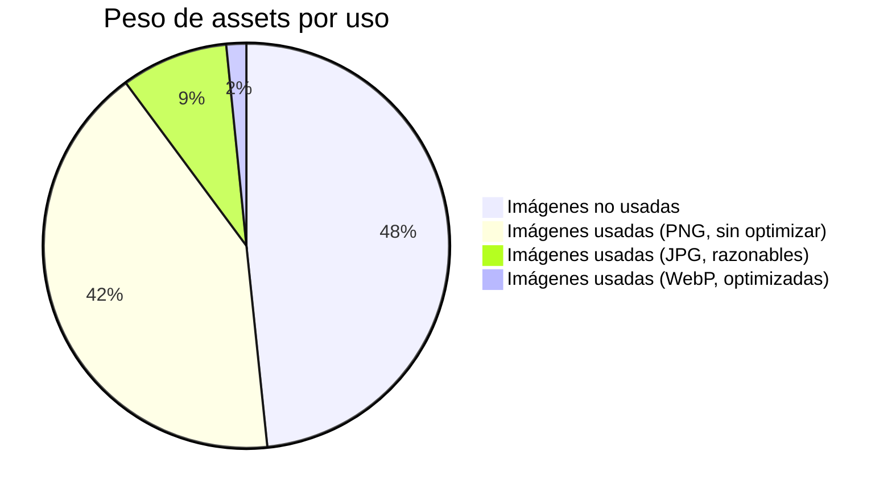
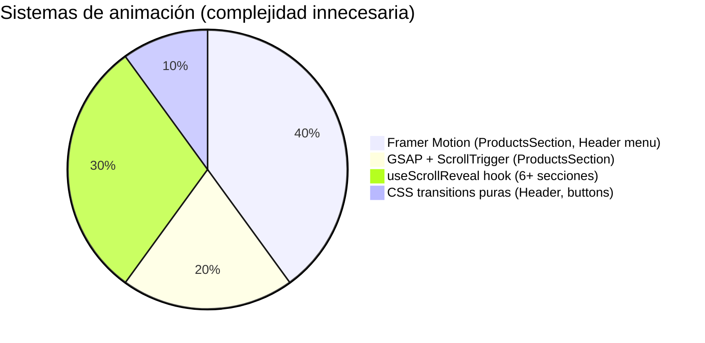

# 🔍 Informe Completo — Luz de Rosa

Auditoría completa del estado actual de la página, con sugerencias de optimización priorizadas por impacto.

---

## 1. Arquitectura General

| Aspecto | Estado |
|---------|--------|
| **Framework** | Vite + React 18 + TypeScript |
| **Styling** | Tailwind CSS 3 + shadcn/ui |
| **Animaciones** | Framer Motion + GSAP + CSS transitions + Hook custom (`useScrollReveal`) |
| **Routing** | React Router (SPA, solo 2 rutas: `/` y `*`) |
| **State** | Local state, `@tanstack/react-query` (instalado pero no usado para data) |
| **Datos** | JSON local con service layer (`productService.ts`) |

### Observaciones
- La página es una **single-page landing** con todo en la ruta `/`. React Router + QueryClient son overhead innecesario para este caso de uso.
- Se usan **3 sistemas de animación distintos** (Framer Motion, GSAP, useScrollReveal con IntersectionObserver). Esto multiplica el bundle JS y crea complejidad. Idealmente se debería usar uno solo.
- El componente [VideoSection.tsx](file:///c:/Users/User/Documents/FullStack/Clone%20Fullstack-conection/Luz3/src/components/VideoSection.tsx) existe pero **no se usa** en [Index.tsx](file:///c:/Users/User/Documents/FullStack/Clone%20Fullstack-conection/Luz3/src/pages/Index.tsx).

---

## 2. Performance — Problemas Actuales

### ✅ Ya corregidos (sesión anterior)
| Problema | Archivo | Fix aplicado |
|----------|---------|-------------|
| `transition-all` en header | Header.tsx | → `transition-[transform,box-shadow,border-color]` |
| `setState` en cada scroll event (footer) | Footer.tsx | → rAF gating + ref comparison |
| `background-attachment: fixed` | GallerySection.tsx | → `` posicionada absoluta |
| Marquee rAF loop infinito (off-screen) | MarqueeText.tsx | → IntersectionObserver para pausar |
| `layout` prop en grid + cards (Framer Motion) | ProductsSection + ProductCard | → Removido |

### ⚠️ Problemas pendientes

#### 2.1 Imágenes — El problema más grande
> [!CAUTION]
> **18.3 MB** en `/src/assets/` — muchas nunca se ven en primera carga.

Las 6 peores imágenes suman **13 MB** solas:

| Archivo | Tamaño | Formato | ¿Se usa? |
|---------|--------|---------|----------|
| `diferentes.jpg` | 4.3 MB | JPG | ❌ No se importa en ningún componente |
| `promo-cake.png` | 2.4 MB | PNG | ❌ Se usa `promo-cake.webp` (72 KB) en su lugar |
| `offers.png` | 2.0 MB | PNG | ✅ OffersSection — **necesita conversión a WebP** |
| `aaa.png` | 1.8 MB | PNG | ❌ Nombre de prueba, no se importa |
| `hero-cakes.png` | 1.8 MB | PNG | ✅ Hero — **la imagen más crítica, sin lazy, 1.8 MB** |
| `gallery-roses.png` | 717 KB | PNG | ✅ GallerySection — debería ser WebP |

> [!IMPORTANT]
> La imagen del **Hero** (`hero-cakes.png`, 1.8 MB) es lo primero que carga el usuario. Debería ser **WebP ≤ 200 KB** y tener dimensiones `srcset` para mobile vs desktop.

#### 2.2 Imágenes sin usar en el bundle
Estos archivos están en `src/assets/` pero **ningún componente los importa**. Vite los incluye en el bundle si están en `src/`:

- `aaa.png` (1.8 MB)
- `diferentes.jpg` (4.3 MB)
- `promo-cake.png` (2.4 MB)
- `flavor-chocolate.jpg`, `flavor-pistachio.jpg`, `flavor-strawberry.jpg`
- `hero-macarons.jpg`, `macaron-fashion.jpg`, `macaron-flowers.jpg`, `macaron-mix.jpg`, `macaron-organic.jpg`
- `promo-box.jpg`, `reservation-bg.jpg`, `special-macaron.jpg`
- `gallery-donuts.jpg`, `gallery-eclairs.jpg`, `gallery-macarons.jpg`, `gallery-millefeuille.jpg`, `gallery-profiteroles.jpg`, `gallery-tarts.jpg`, `gallery-truffles.jpg`
- `sweet_products_group.png`, `video-bg.jpg`

> [!TIP]
> Los archivos en `src/assets/` que no se importan no entran al bundle de producción (Vite usa tree-shaking). Pero ocupan espacio en el repo y confunden. Recomiendo moverlos a una carpeta `_unused/` o borrarlos.

#### 2.3 Producto placeholder repetido
En [products.json](file:///c:/Users/User/Documents/FullStack/Clone%20Fullstack-conection/Luz3/src/data/products.json), **7 de 16 productos** usan la misma imagen placeholder `/images/producto-bellaria.png` (620 KB, PNG). Son: Cupcakes (x2), Popcakes (x2), Oreos Bañadas, Ice Pop.

#### 2.4 Google Fonts bloqueante
```html
<!-- index.css línea 1 -->
@import url('https://fonts.googleapis.com/css2?family=Jost:...');
```
El `@import` dentro del CSS es **render-blocking**. El navegador no puede pintar nada hasta que descargue las fuentes. Debería ser un `<link rel="preload">` en `index.html`.

#### 2.5 Google Maps iframe en Footer
El `<iframe>` de Google Maps se carga siempre, aunque esté al final de la página. Son ~500 KB de JS/recursos adicionales. Debería cargarse solo cuando el footer sea visible.

#### 2.6 Dicebear avatars (requests externos)
Los testimonios en [SpecialProductSection.tsx](file:///c:/Users/User/Documents/FullStack/Clone%20Fullstack-conection/Luz3/src/components/SpecialProductSection.tsx#L7-L28) hacen 4 requests a `api.dicebear.com` para generar avatares SVG. Si ese servicio se cae, los avatares se rompen. Mejor generar los SVGs localmente.

---

## 3. Experiencia Móvil — Análisis por Sección

### Flujo de secciones en mobile

```
Header (sticky, h-20) ← 80px de espacio fijo
  ↓
Hero (100dvh - 3.5rem) ← bien, usa dvh
  ↓
AboutSection ← ⚠️ sin padding-top en mobile
  ↓
FlavorsSection (py-24) ← cards de 500px fixed height
  ↓
ProductSection (pt-24) ← cards de 520px fixed height
  ↓
ProductsSection / Catálogo (pt-20) ← grid 2 cols en mobile
  ↓
PromoBanner (py-24)
  ↓
OffersSection (py-16) ← steps 1-col
  ↓
GallerySection ← grid 2 cols, auto-rows 160px
  ↓
MarqueeText
  ↓
SpecialProductSection / Testimonios
  ↓
FAQSection ← ⚠️ sin padding-top en mobile
  ↓
Imagen antefooter (h-96)
  ↓
Footer
```

### Problemas específicos de mobile

| Sección | Problema | Impacto |
|---------|----------|---------|
| **AboutSection** | `className=" md:py-10"` — en mobile NO tiene `py`, el contenido queda pegado a la sección anterior | 🔴 Alto |
| **AboutSection** | `mt-12` en el `<h2>` — demasiado espacio entre el subtítulo y el título en mobile | 🟡 Medio |
| **AboutSection** | `mt-24` en "Romina Brito" — deja un hueco enorme en pantallas chicas | 🟡 Medio |
| **FAQSection** | `className=" md:pt-12 pb-2"` — en mobile no tiene `pt`, queda pegada a la sección anterior | 🔴 Alto |
| **FlavorsSection** | Cards con `h-[500px]` fija — en pantallas <375px el texto se puede cortar | 🟡 Medio |
| **ProductSection** | Cards con `h-[520px]` fija — mismo problema que FlavorsSection | 🟡 Medio |
| **Header** | `h-20` en mobile (80px) — ocupa mucho espacio vertical; el header de desktop es `md:h-16` (64px) | 🟡 Medio |
| **Hero** | Usa `hero-cakes.png` (1.8 MB) sin `srcset` — en 4G tarda ~6-8 segundos en cargar | 🔴 Alto |
| **GallerySection** | 16 imágenes en grid, todas con `loading="lazy"` ✅ pero 4 son PNGs de 600-700 KB cada una | 🟡 Medio |
| **PromoBanner** | `backdrop-blur-xl` en el contenedor — en mobile esto es costoso por GPU | 🟢 Bajo |
| **ProductsSection** | El grid es `grid-cols-2` en mobile — las cards quedan muy estrechas en pantallas <360px | 🟡 Medio |
| **ProductsSection (Modal)** | Botón **Atrás** del dispositivo cerraba la pestaña en vez de cerrar el modal | 🔴 Alto |

### Fix aplicado: Botón Atrás cierra el modal (sin cambiar URL)

**Archivo:** `src/components/sections/ProductsSection.tsx`

**Problema**
El modal de producto se abría solo con estado React (`activeProduct`). En mobile, al tocar **Atrás**, el navegador no tenía un estado propio que “cerrar”, entonces volvía a la página anterior o cerraba el WebView.

**Solución implementada (sin router, sin cambiar URL)**
- Al abrir el modal se ejecuta `history.pushState(...)` para crear una entrada extra en el historial (no modifica la URL).
- Mientras el modal está abierto se agrega un listener a `window.popstate`.
- Si llega un `popstate` y el modal está abierto: se cierra el modal (`setActiveProduct(null)`) en vez de salir del navegador.
- Al cerrar con la X o tocando el overlay: se llama `history.back()` solo si ese `pushState` fue disparado por el modal.

**Cuidado contra loops / historial roto**
- Se usa `useRef` (`didPushModalStateRef`) para saber si el estado del historial lo empujó el modal.
- Se limpia el listener de `popstate` al cerrar para evitar leaks.
| **Footer** | Google Maps iframe se carga siempre en mobile, ~500 KB en 4G | 🟡 Medio |

### Touch targets
- ✅ Los botones principales ("Reserva Ya", "Pedí tu torta") tienen buen tamaño
- ✅ El botón de WhatsApp flotante es 56x56px
- ⚠️ Los links de nav en desktop son `px-4 py-2` pero no afectan mobile (el menú mobile es fullscreen)
- ⚠️ Los FAQ items tienen `py-7 md:py-5` — en mobile son 56px de touch target, que está bien

---

## 4. Dependencias y Bundle

### Paquetes pesados instalados pero poco usados

| Paquete | Tamaño estimado | Uso actual | Recomendación |
|---------|----------------|------------|---------------|
| `gsap` + `ScrollTrigger` | ~60 KB min | Solo en ProductsSection (header/filter reveal) | Reemplazar con `useScrollReveal` que ya existe |
| `@tanstack/react-query` | ~40 KB min | Solo wrappea la app, no se usa para fetching real | Remover si no se va a conectar a API |
| `react-router-dom` | ~30 KB min | Solo 2 rutas (`/` y `*`), es una SPA simple | Remover si solo hay una landing |
| `recharts` | ~100 KB min | No se usa en ningún componente | Remover |
| `react-hook-form` + `@hookform/resolvers` + `zod` | ~50 KB min | No hay forms en la página | Remover |
| `react-day-picker` + `date-fns` | ~50 KB min | No se usa | Remover |
| `embla-carousel-react` | ~15 KB min | No se usa directamente | Remover si no hay carrusel |
| `react-resizable-panels` | ~15 KB min | No se usa | Remover |
| `input-otp` | ~8 KB min | No se usa | Remover |
| `vaul` (drawer) | ~10 KB min | No se usa | Remover |
| `sonner` | ~12 KB min | Montado en App pero no se envía ningún toast | Remover o mantener para futuro |

> [!WARNING]
> **Estimación conservadora: ~390 KB de JS minificado** que no se usa. En una conexión 4G esto puede significar 2-3 segundos extra de carga.

### Componentes shadcn/ui instalados pero no usados
La carpeta `components/ui/` tiene **50 archivos**. En la página solo se usan:
- `ElegantDivider.tsx` ✅
- `sonner.tsx` (montada pero sin toasts)
- `toaster.tsx` (montada pero sin toasts)
- `tooltip.tsx` (provider montado)

Los otros **46 componentes** (accordion, alert-dialog, avatar, badge, breadcrumb, button, calendar, card, carousel, chart, checkbox, collapsible, command, context-menu, dialog, drawer, dropdown-menu, form, hover-card, input-otp, input, label, menubar, navigation-menu, pagination, popover, progress, radio-group, resizable, scroll-area, select, separator, sheet, sidebar, skeleton, slider, switch, table, tabs, textarea, toast, toggle-group, toggle, use-toast) no se usan.

> [!TIP]
> Los componentes no importados no entran al bundle gracias al tree-shaking de Vite. Pero ensucian el proyecto. Podés borrar los que no uses.

---

## 5. SEO y Accesibilidad

### HTML (`index.html`)
| Aspecto | Estado | Nota |
|---------|--------|------|
| `lang` | ⚠️ `lang="en"` | Debería ser `lang="es"` (contenido en español) |
| `<title>` | ✅ "Luz de Rosa" | Podría ser más descriptivo: "Luz de Rosa · Tortas Artesanales" |
| `<meta description>` | ⚠️ "Luz de Rosa" | Demasiado corto, debería describir el negocio |
| `og:image` | ❌ Falta | No hay imagen para compartir en redes |
| `og:url` | ❌ Falta | |
| `favicon` | ⚠️ 92 KB `.ico` | Debería ser un favicon moderno (SVG/PNG, < 10 KB) |
| `robots.txt` | ✅ Existe | |

### Accesibilidad
- ✅ Aria labels en botones del menú mobile
- ✅ `aria-hidden` en elementos decorativos (marquee, overlays)
- ✅ `alt` text en todas las imágenes
- ⚠️ No hay `<main>` landmark — el contenido está directamente en un `<div>`
- ⚠️ No hay skip navigation link
- ⚠️ El play button del VideoSection (no usado) no tiene funcionalidad

---

## 6. Problemas de Código

### 6.1 `_comment` en products.json
```json
{ "_comment": "═══ TORTAS — 10 productos ═══" },
```
Estos objetos pasan por el filtro `p?.id !== undefined` en `productService.ts`, pero son una forma no estándar de comentar JSON. Mejor usar un archivo `.ts` con comentarios reales.

### 6.2 Product.subtitle no existe
En [ProductSection.tsx:106](file:///c:/Users/User/Documents/FullStack/Clone%20Fullstack-conection/Luz3/src/components/ProductSection.tsx#L106):
```tsx
<span>{p.subtitle}</span>
```
Pero el tipo `Product` no tiene `subtitle`, y los objetos de `products` tampoco definen esa propiedad. Se renderiza `undefined` silenciosamente.

### 6.3 Tipografía: `font-serif` apunta a "Jost"
En [tailwind.config.ts:18](file:///c:/Users/User/Documents/FullStack/Clone%20Fullstack-conection/Luz3/tailwind.config.ts#L18):
```ts
serif: ["Jost", "sans-serif"],
```
Jost es una fuente **sans-serif**, pero está configurada como `font-serif`. No es un bug funcional, pero el naming es confuso.

### 6.4 Color `celeste` definido pero sin variable CSS
En [tailwind.config.ts:35](file:///c:/Users/User/Documents/FullStack/Clone%20Fullstack-conection/Luz3/tailwind.config.ts#L35):
```ts
celeste: "hsl(var(--celeste))",
```
Pero `--celeste` no está definido en `index.css`. Usar esta clase causaría un error visual silencioso.

---

## 7. Sugerencias Priorizadas

### 🔴 Prioridad Alta (mayor impacto)

1. **Convertir imágenes críticas a WebP**
   - `hero-cakes.png` (1.8 MB) → WebP ~150 KB
   - `offers.png` (2.0 MB) → WebP ~120 KB
   - `gallery-*.png` (4 archivos, ~2.7 MB total) → WebP ~300 KB total
   - Impacto: **-6 MB** de carga, la página carga 5-8 seg más rápido en mobile

2. **Agregar `srcset` a la imagen Hero**
   - Servir 640px en mobile, 1280px en tablet, 1920px en desktop
   - Impacto: en mobile la imagen pasa de 1.8 MB a ~60 KB

3. **Mover la fuente de `@import` CSS a `<link preload>` en `index.html`**
   - Impacto: el texto aparece ~300-500ms antes

4. **Agregar padding-top a AboutSection y FAQSection en mobile**
   - Impacto: las secciones dejan de quedar "pegadas"

5. **Borrar assets no usados** (`aaa.png`, `diferentes.jpg`, `promo-cake.png`, etc.)
   - Impacto: -8.5 MB del repositorio

### 🟡 Prioridad Media

6. **Eliminar GSAP** — reemplazar los 2 scroll reveals de ProductsSection con `useScrollReveal`
   - Impacto: -60 KB de JS del bundle

7. **Eliminar paquetes no usados** (recharts, react-hook-form, zod, date-fns, etc.)
   - Impacto: -300+ KB potenciales del bundle (tree-shaking ya ayuda, pero los paquetes siguen en `node_modules` y en lock files)

8. **Lazy-load el iframe de Google Maps** en Footer
   - Impacto: -500 KB en carga inicial mobile

9. **Usar alturas responsivas en lugar de fijas** para FlavorsSection y ProductSection cards
   - Cambiar `h-[500px]` → `min-h-[400px] h-auto` o similar
   - Impacto: mejor UX en pantallas chicas

10. **Generar avatares SVG localmente** en vez de depender de `api.dicebear.com`
    - Impacto: eliminás 4 requests externos y un punto de fallo

### 🟢 Prioridad Baja (polish)

11. Cambiar `lang="en"` → `lang="es"` en `index.html`
12. Mejorar `<meta description>` para SEO
13. Agregar `og:image` para compartir en redes sociales
14. Envolver el contenido en `<main>` para accesibilidad
15. Limpiar componentes shadcn/ui no usados (46 archivos)
16. Renombrar `font-serif` → `font-display` en tailwind config (claridad)
17. Definir la variable CSS `--celeste` o borrar la referencia en tailwind
18. Cambiar el favicon de 92 KB `.ico` a un SVG/PNG moderno

---

## 8. Resumen Visual





> [!IMPORTANT]
> El **mayor ganancia con menor esfuerzo** es la conversión de imágenes a WebP. Solo con el Hero + Offers + Gallery PNGs, la carga en mobile podría pasar de **~20 segundos en 4G a ~4 segundos**.
